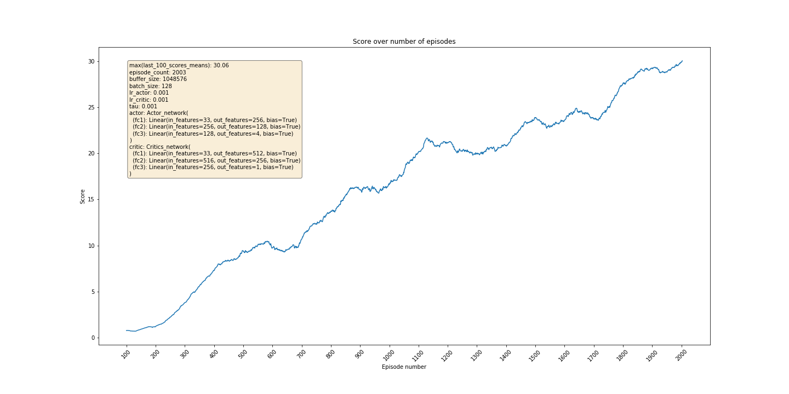

# Continuous control with DDPG

## Learning algorithm

In this project I applied the DDPG algorithm to control a double-jointed arm so that the agent's hand is in the goal location for as many time steps as possible in the Reacher Unity Environment. My understanding of this algorithm this algorithm comes from DeepMind's paper ["Continuous control with deep reinforcement learning"](https://arxiv.org/pdf/1509.02971.pdf), written by authors Timothy P. Lillicrap, Jonathan J. Hunt and others, and from Alexis Cook's application in Udacity's Deep Reinforcement Learning [repo](https://github.com/udacity/deep-reinforcement-learning/tree/master/ddpg-bipedal)

### Hyperparameters
The DDPG agent's hyperparameters were the following:
```
BUFFER_SIZE = 1048576
BATCH_SIZE = 128
GAMMA = 0.99
TAU = 0.001
ACTOR_LR = 0.001
CRITIC_LR = 0.001
WEIGHT_DECAY = 0
UPDATE_EVERY = 10
```

### Actor and Critic model architecture
I used a relatively simple neural network with 2 fully-connected hidden layers and 1 output layer.

The critic network has:

- 512 units in the first hidden layer
- 256 units in the second hidden layer
- ReLU activation in both hidden layers
- 1 output unit for the value of the `(state, action)` pair
- no activation in the output layer

The actor network has:

- 256 units in the first hidden layer
- 128 units in the second hidden layer
- ReLU activation in both hidden layers
- 4 output units, one for each joint
- tanh activation in the output layer

### Plot of Rewards


### Ideas for future work
Next ideas to explore to decrease the number of episodes needed to solve the environment:
- Different values of discount rate, learning rate, soft-update rate, batch size and buffer size
- Different number of layers, units per layer and activation function
- Different algorithmic solutions, such as:
    - D4PG
    - A3C
    - PPO